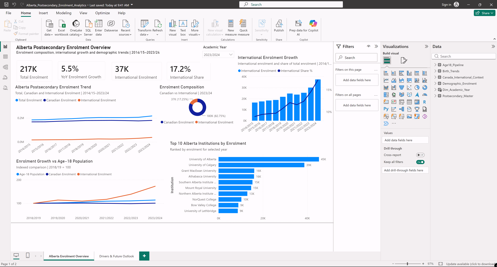
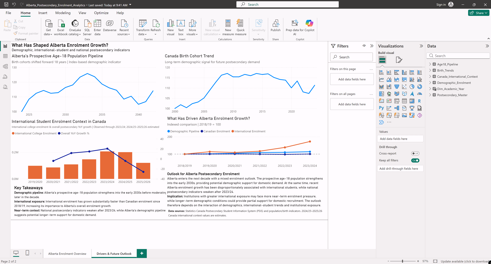

# Power BI Dashboard
# Developed by Devangi Parekh | 2026 | Portfolio Project

This folder contains the Power BI report developed for the Alberta Postsecondary Enrolment Analytics project.

The report consists of two analytical pages:

1. **Alberta Enrolment Overview** — historical enrolment trends, international enrolment growth, enrolment composition, institution-level enrolment, and demographic comparison.

2. **Drivers & Future Outlook** — demographic pipeline, Canadian birth-cohort trends, international-student context, and potential drivers of future Alberta postsecondary enrolment.

